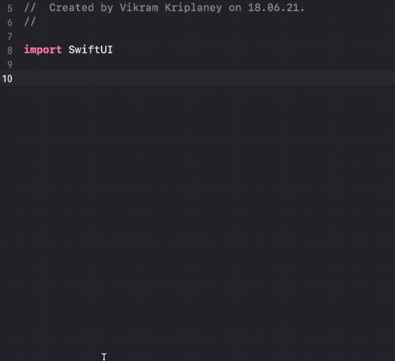

# SwiftUI-Xcode-Snippets

A collection of Xcode snippets that I use every day.

## Installation

Download and copy any or all of the code snippet files into your `~/Library/Developer/Xcode/UserData/CodeSnippets` directory.

| File     | Title | Summary | Prefix |
|----------|-------|---------|--------|
| [CodingKeys](https://github.com/markiv/SwiftUI-Xcode-Snippets/blob/main/CodingKeys.codesnippet) | CodingKeys | enum CodingKey | `ck` |
| [ColorLiteral](https://github.com/markiv/SwiftUI-Xcode-Snippets/blob/main/ColorLiteral.codesnippet) | Color Literal | A Swift color literal | `clr` |
| [Combine-Cancellables](https://github.com/markiv/SwiftUI-Xcode-Snippets/blob/main/Combine-Cancellables.codesnippet) | cancellables | Combine set of cancellables | `canc` |
| [Countries and currencies](https://github.com/markiv/SwiftUI-Xcode-Snippets/blob/main/Countries and currencies.codesnippet) | Countries and Currencies | Arrays of placeholder data | `coun` |
| [EmojiFlag](https://github.com/markiv/SwiftUI-Xcode-Snippets/blob/main/EmojiFlag.codesnippet) | emojiFlag | String extension for Unicode flags | `emojiFlag` |
| [Lorem Ipsum](https://github.com/markiv/SwiftUI-Xcode-Snippets/blob/main/Lorem Ipsum.codesnippet) | Lorem Ipsum | A paragraph of placeholder text | `lorem` |
| [MARK](https://github.com/markiv/SwiftUI-Xcode-Snippets/blob/main/MARK.codesnippet) | MARK | MARK: - Code separator | `mk` |
| [PrintFunction](https://github.com/markiv/SwiftUI-Xcode-Snippets/blob/main/PrintFunction.codesnippet) | Print Function | Prints the current function name, file and line number | `pf` |
| [PublishedProperty](https://github.com/markiv/SwiftUI-Xcode-Snippets/blob/main/PublishedProperty.codesnippet) | Published Property | A Combine Published property | `pbl` |
| [Swift-AsyncAfter](https://github.com/markiv/SwiftUI-Xcode-Snippets/blob/main/Swift-AsyncAfter.codesnippet) | Async After | Perform a closure after a time interval | `after` |
| [Swift-IfDebug](https://github.com/markiv/SwiftUI-Xcode-Snippets/blob/main/Swift-IfDebug.codesnippet) | #if DEBUG | #if DEBUG compiler directive | `ifd` |
| [Swift-IfSimulator](https://github.com/markiv/SwiftUI-Xcode-Snippets/blob/main/Swift-IfSimulator.codesnippet) | #if Simulator | #if target is Simulator compiler directive | `ifs` |
| [Swift-return](https://github.com/markiv/SwiftUI-Xcode-Snippets/blob/main/Swift-return.codesnippet) | return something | A return statement | `rt` |
| [SwiftUI-Button](https://github.com/markiv/SwiftUI-Xcode-Snippets/blob/main/SwiftUI-Button.codesnippet) | SwiftUI Button | A SwiftUI Button with label | `but` |
| [SwiftUI-Environment](https://github.com/markiv/SwiftUI-Xcode-Snippets/blob/main/SwiftUI-Environment.codesnippet) | SwiftUI Environment | A SwiftUI Environment variable | `env` |
| [SwiftUI-ForEachIndexedCollection](https://github.com/markiv/SwiftUI-Xcode-Snippets/blob/main/SwiftUI-ForEachIndexedCollection.codesnippet) | SwiftUI ForEach over indexed collection | SwiftUI ForEach over an indexed collection | `fori` |
| [SwiftUI-FrameInfinity](https://github.com/markiv/SwiftUI-Xcode-Snippets/blob/main/SwiftUI-FrameInfinity.codesnippet) | Frame Infinity | Add a frame of infinite size | `inf` |
| [SwiftUI-LargestPreferenceKey](https://github.com/markiv/SwiftUI-Xcode-Snippets/blob/main/SwiftUI-LargestPreferenceKey.codesnippet) | SwiftUI Gather Largest Size with PreferenceKey | SwiftUI: Gather the largest size unsing PreferenceKey | `lpk` |
| [SwiftUI-List1000](https://github.com/markiv/SwiftUI-Xcode-Snippets/blob/main/SwiftUI-List1000.codesnippet) | List 1000 | A List of 1000 simple items | `l1` |
| [SwiftUI-LongText](https://github.com/markiv/SwiftUI-Xcode-Snippets/blob/main/SwiftUI-LongText.codesnippet) | SwiftUI Long Text | A SwiftUI Text view with a long placeholder text | `tlorem` |
| [SwiftUI-Preview](https://github.com/markiv/SwiftUI-Xcode-Snippets/blob/main/SwiftUI-Preview.codesnippet) | SwiftUI Preview | A SwiftUI Preview | `spv` |
| [SwiftUI-PrintChanges](https://github.com/markiv/SwiftUI-Xcode-Snippets/blob/main/SwiftUI-PrintChanges.codesnippet) | Print Changes | Print changes in a SwiftUI view | `pc` |
| [SwiftUI-RandomOnlineImage](https://github.com/markiv/SwiftUI-Xcode-Snippets/blob/main/SwiftUI-RandomOnlineImage.codesnippet) | Random Online Image | A random online image from picsum | `rndimg` |
| [SwiftUI-SampleList](https://github.com/markiv/SwiftUI-Xcode-Snippets/blob/main/SwiftUI-SampleList.codesnippet) | SwiftUI List sample items | A SwiftUI List with sample items (currency names) | `items` |
| [SwiftUI-StateVariable](https://github.com/markiv/SwiftUI-Xcode-Snippets/blob/main/SwiftUI-StateVariable.codesnippet) | SwiftUI State Variable | A SwiftUI @State variable | `stt` |
| [SwiftUI-SwiftLogo](https://github.com/markiv/SwiftUI-Xcode-Snippets/blob/main/SwiftUI-SwiftLogo.codesnippet) | Swift Logo | The Swift logo as a placeholder view | `swl` |
| [SwiftUI-SystemImage](https://github.com/markiv/SwiftUI-Xcode-Snippets/blob/main/SwiftUI-SystemImage.codesnippet) | SwiftUI System Image | SwiftUI Image with an SF Symbol | `ims` |
| [SwiftUI-Text](https://github.com/markiv/SwiftUI-Xcode-Snippets/blob/main/SwiftUI-Text.codesnippet) | SwiftUI Text | SwiftUI Text with placeholder | `txt` |
| [SwiftUI-TextWithExpression](https://github.com/markiv/SwiftUI-Xcode-Snippets/blob/main/SwiftUI-TextWithExpression.codesnippet) | SwiftUI Text with interpolated string expression | SwiftUI Text with interpolated string expression | `sti` |
| [SwiftUI-UIViewControllerRepresentable](https://github.com/markiv/SwiftUI-Xcode-Snippets/blob/main/SwiftUI-UIViewControllerRepresentable.codesnippet) | SwiftUI View Controller Representable | Template for when you want to wrap a UIKit View Controller into a SwiftUI View | `svcr` |
| [SwiftUI-UIViewRepresentable](https://github.com/markiv/SwiftUI-Xcode-Snippets/blob/main/SwiftUI-UIViewRepresentable.codesnippet) | SwiftUI UIViewRepresentable | Template for when you want to wrap a UIKit View into a SwiftUI View | `svr` |
| [SwiftUI-View](https://github.com/markiv/SwiftUI-Xcode-Snippets/blob/main/SwiftUI-View.codesnippet) | SwiftUI View | Just a SwiftUI View with a placeholder body | `sv` |
| [SwiftUI-ViewBuilderVar](https://github.com/markiv/SwiftUI-Xcode-Snippets/blob/main/SwiftUI-ViewBuilderVar.codesnippet) | ViewBuilder var | A @ViewBuilder variable | `vbv` |
| [SwiftUI-ViewModel](https://github.com/markiv/SwiftUI-Xcode-Snippets/blob/main/SwiftUI-ViewModel.codesnippet) | SwiftUI ViewModel class | SwiftUI ViewModel class | `vmo` |
| [SwiftUI-ViewModifier](https://github.com/markiv/SwiftUI-Xcode-Snippets/blob/main/SwiftUI-ViewModifier.codesnippet) | SwiftUI View Modifier | A SwiftUI View Modifier | `vm` |
| [SwiftUI-ViewWithModel](https://github.com/markiv/SwiftUI-Xcode-Snippets/blob/main/SwiftUI-ViewWithModel.codesnippet) | SwiftUI View with ViewModel |  | `svm` |
| [SwiftUI-WebView](https://github.com/markiv/SwiftUI-Xcode-Snippets/blob/main/SwiftUI-WebView.codesnippet) | WebView | A WKWebView wrapped into a UIViewRepresentable | `wv` |
| [SwiftUI-WrappedUIView](https://github.com/markiv/SwiftUI-Xcode-Snippets/blob/main/SwiftUI-WrappedUIView.codesnippet) | Wrapped UIView | A template for any wrapped UIView | `uv` |
| [URL by String Literal](https://github.com/markiv/SwiftUI-Xcode-Snippets/blob/main/URL by String Literal.codesnippet) | URL by String Literal | URL extension to make URLs expressible by string literals | `uxs` |

